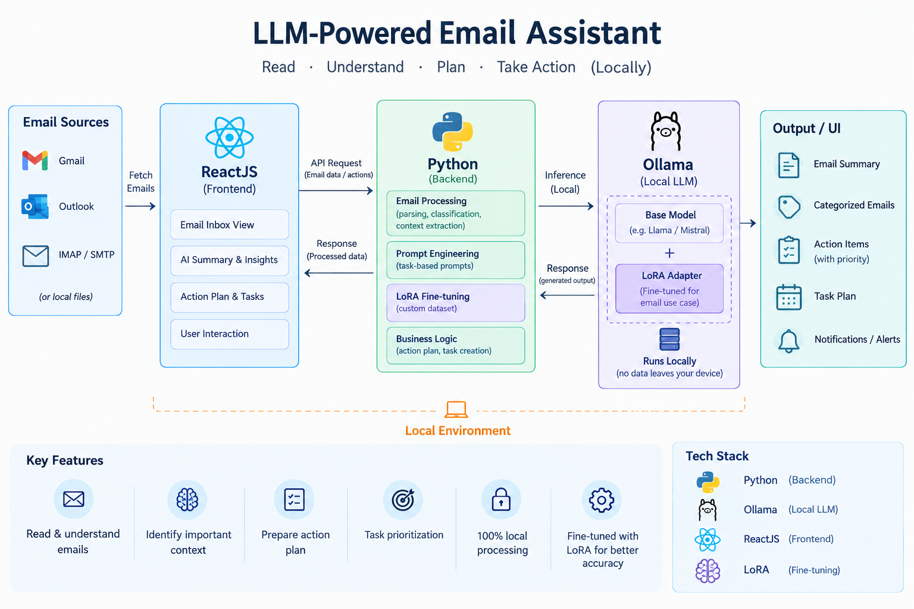

# 🤖 LLM-Powered Email Assistant

A local LLM-powered Email Assistant that reads emails, understands their context, identifies what needs attention, and prepares an actionable plan.

The project is built to experiment with **local LLMs, LoRA fine-tuning, and AI-powered workflow automation** without depending entirely on cloud-based AI services.

## 🏗️ Architecture



## ✨ What It Does

- 📧 Reads and processes emails
- 🧠 Understands email context
- 🏷️ Categorizes emails
- 📋 Identifies action items
- 🎯 Helps prioritize tasks
- 📝 Prepares an action plan
- 🦙 Uses a local LLM through Ollama
- 🧠 Uses LoRA fine-tuning for the specific use case
- 🔒 Keeps LLM processing local

## 🛠️ Tech Stack

| Component          | Technology       |
| ------------------ | ---------------- |
| Frontend           | ReactJS          |
| Backend            | Python / FastAPI |
| ASGI Server        | Uvicorn          |
| LLM Runtime        | Ollama           |
| Fine-tuning        | LoRA (as part of  performance tunning it's not included here)            |
| AI Model           | Local LLM        |
| Package Management | uv               |

## 🔄 Application Flow

```text
Email
  │
  ▼
ReactJS Frontend
  │
  │ API Request
  ▼
FastAPI Backend
  │
  ├── Email Processing
  ├── Prompt Engineering
  ├── Business Logic
  │
  ▼
Ollama
  │
  ├── Base Local LLM
  └── LoRA Fine-tuned Model
  │
  ▼
Generated Insights
  │
  ├── Email Summary
  ├── Category
  ├── Action Items
  └── Action Plan
  │
  ▼
ReactJS UI
```

## 🚀 Getting Started

### Prerequisites

Make sure you have the following installed:

- Python
- `uv`
- Node.js and npm
- Ollama
- A compatible local LLM model

### 1. Clone the repository

```bash
git clone <your-repository-url>
cd <your-project-directory>
```

### 2. Start the Ollama model

Make sure Ollama is running on your machine and that the required model is available.

For example:

```bash
ollama serve
```

Then, depending on the model configured by the project:

```bash
ollama run <your-model>
```

> Replace `<your-model>` with the model you are using.

---

## 🐍 Start the FastAPI Backend

Navigate to the backend directory:

```bash
cd backend
```

Install/sync the Python dependencies using `uv`:

```bash
uv sync
```

Start the FastAPI application using Uvicorn:

```bash
uv run uvicorn main:app --reload
```

The backend should now be available at:

```text
http://localhost:8000
```

FastAPI's interactive API documentation should be available at:

```text
http://localhost:8000/docs
```

> If your FastAPI entry file or application object has a different name, update `main:app` accordingly.

---

## ⚛️ Start the ReactJS Frontend

Open another terminal and navigate to the frontend directory:

```bash
cd frontend
```

Install the npm dependencies:

```bash
npm install
```

Start the development server:

```bash
npm run dev
```

The frontend will normally be available at the URL shown by Vite in the terminal, commonly:

```text
http://localhost:5173
```

---

## 🧠 LoRA Fine-Tuning

This project also explores **LoRA (Low-Rank Adaptation)** to fine-tune/adapt the LLM for the email-assistant use case.

Instead of training an entire model from scratch, LoRA allows the model to be adapted using a much smaller set of trainable parameters.

The idea is:

```text
Base Local LLM
      │
      ▼
   LoRA Adapter
      │
      ▼
Email-specific LLM Behaviour
```

This makes experimentation with domain-specific LLM behaviour more accessible on local hardware.

## 🔐 Why Local LLM?

One of the goals of this project is to explore what can be achieved with an LLM running locally.

Potential advantages include:

- Data can remain on the local machine
- No mandatory cloud LLM API dependency
- More control over the model
- Easier experimentation
- Useful for privacy-sensitive workflows

## 📌 Project Status

🚧 **Experimental / Personal Project**

This project was created as a long-weekend experiment to explore practical applications of local LLMs, LoRA fine-tuning, and AI-powered automation.

## 💡 What's Next?

Some areas I would like to explore further:

- 🤖 AI agents
- 🔧 Tool calling
- 🧠 Conversation memory
- 📅 Automated task creation
- 🔔 Notifications and reminders
- 📊 Better email prioritization
- 🔄 Automated actions based on email intent
- 🧩 Multi-agent workflows

## 💼 LinkedIn

I shared the project and my experience building it on LinkedIn:

[](https://www.linkedin.com/feed/update/urn:li:share:7512496933198901249/)

👉 **[Read the full LinkedIn post](https://www.linkedin.com/feed/update/urn:li:share:7512496933198901249/)**

---

### ⭐ If you find the project interesting

Feel free to explore, experiment, and build your own LLM-powered workflow around a problem you deal with every day.
